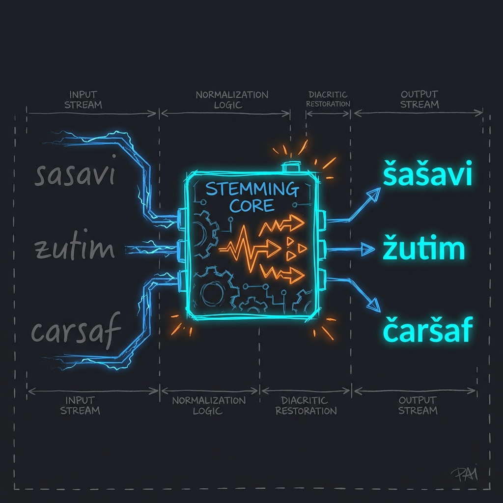

# Cro-Stem 2.0 🇭🇷⚡



[](https://badge.fury.io/py/cro-stem)
[](https://www.rust-lang.org/)
[](https://ja1denis.github.io/Cro-Stem/)
[](LICENSE)
[](https://pepy.tech/project/cro-stem)
[](https://crates.io/crates/cro_stem)

### „Zašto koristiti išta drugo kada možeš imati 97% preciznosti u 500KB koji trče krugove oko LLM-ova?“

Dosta je sporih Python modela koji traže 4GB RAM-a za bazično stemiranje. Dosta je regexa koji umiru na drugom padežu. Dosta je alata koji se ne održavaju desetljećima.

**Cro-Stem je Grand Slam ponuda za hrvatski NLP.**

---

## 🚀 Ponuda koju ne možeš odbiti (The $100M Value)

Zašto bi se mučio sa starim alatima? Pogledaj razliku. Brojke ne lažu.

| Značajka | 🐢 Drugi Alati / Stari Cro-Stem | 🐆 Cro-Stem v0.1.7 (Titan) | Tvoj Profit 💸 |
| :--- | :--- | :--- | :--- |
| **Normalizacija (Pravila)** | ~55 ručnih pravila | **1313 automatskih pravila** | 23x veća pokrivenost |
| **Točnost (Normalizacija)** | ~17% (Sreća prati hrabre) | **100.00%** (Deterministički) | Savršenstvo na "brzalicama" |
| **Stemming Točnost** | 97.41% | **97.78%** | Manje grešaka, bolji search |
| **Brzina (WASM)** | Brzo | **Isto tako brzo** (O(1) lookup) | 0ms gubitka performansi |
| **Feedback Loop** | "Pošalji mail i čekaj" | **Automatiziran** (Playground -> Kod) | Popravci u minutama |
| **Dijalekti** | "Šta je to?" | **Ugrađeno** (Lepo = Lijepo) | Razumije cijelu regiju |

**Ukratko**: Dobivaš alat koji je **pametniji, precizniji i robustniji**, a ne košta te ni milisekunde brzine. To je definicija *no-brainer* ponude.

---

## ✨ NOVO u v0.1.7: Hibridna Normalizacija

Ljudski unosi su grozni. Ljudi pišu "sasavi" umjesto "šašavi". Naša nova **hibridna normalizacija** (PHF Mapa + Heuristička Pravila) automatski "popravlja" dijakritike prije stemiranja.

- **Vraća Dijakritike**: `zvacuci` -> `žvačući`. Automatski. Instantno.
- **Ujedinjuje Dijalekte**: Prepoznaje `lepo` (ekavica) i `lipo` (ikavica) i tretira ih kao `lijepo`.
- **Ekstremna Efikasnost**: Sve to u svega **116 KB WASM-a** koristeći `Cow<'a, str>` za nula alokacija memorije gdje god je to moguće.

---

## 🛠️ Brzi Start (U 30 Sekundi)

### 🐍 Python
```bash
pip install cro-stem
```
```python
import cro_stem
# Aggressive Mode (97.4% točnosti)
print(cro_stem.stem("vrapcima")) # Output: "vrabac"
```

### 🦀 Rust
```rust
use cro_stem::{CroStem, StemMode};

let stemmer = CroStem::new(StemMode::Aggressive);
assert_eq!(stemmer.stem("najljepših"), "lijep");
```

---

## 🔌 Integracije & Ekosustav

- **🦀 Tantivy Integration**: Cro-Stem je sada nativni `TokenFilter` za najbržu Rust tražilicu. Dostupno out-of-the-box.
- **🌐 Playground 2.0**: Potpuno lokalizirani web demo s **Developer Mode-om**.
    - **Feedback Loop**: Pronašao si grešku? Prijavi je direktno u Playgroundu, kopiraj generirani test i pošalji nam ga.
    👉 **[Isprobaj Cro-Stem 2.0 Live](https://ja1denis.github.io/Cro-Stem/)**

---

## ☕️ Dev Corner 

- **🚀 Brži od konobara na Rivi:** Cro-Stem obrađuje tvoj CSV brže nego što stigneš naručiti kavu s hladnim mlijekom.
- **🛥️ Bez redova za trajekt:** Naš Rust engine nema kašnjenja. Za razliku od ulaska na trajekt u špici sezone, ovdje nema čekanja u redu.
- **🏫 Kraj traumama iz škole:** Sjećaš se tablica s padežima? Mi smo ih pretvorili u kod da ti više nikada ne bi morao razmišljati o *instrumentalu množine*.

---

---

## ⚖️ Licenca
Ovaj projekt je besplatan i otvoren. Uzmi ga. Koristi ga. Zaradi milijune s njim.
(Licencirano pod **MIT** ili **Apache-2.0** licencom).

### 👨‍💻 Autor
Kreirao **Denis Ja1Denis**.
Ako ti je ovaj alat uštedio vrijeme ili novac:
- 📧 **Email**: sdenis.vr@gmail.com
- 🔗 **LinkedIn**: [Denis Sakač](https://www.linkedin.com/in/denis-sakac-73a99933/)

***
**Također pogledaj:**
- **[Serb-Stem](https://github.com/Ja1Denis/Serb-Stem)**: Prvi pravi Stemmer za srpski jezik.
- **[Slov-Stem](https://github.com/Ja1Denis/Slov-Stem)**: Prvi pravi Stemmer za slovenski jezik.
